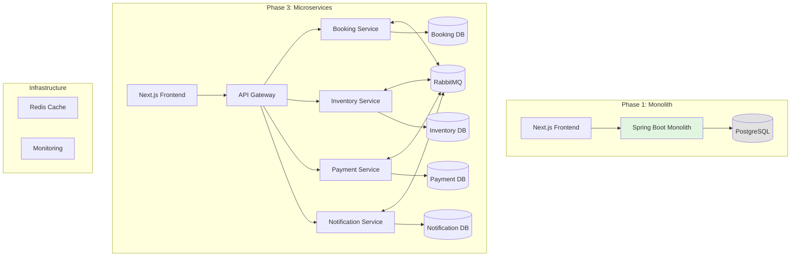

# Hotel Booking System Solution Architecture Learning Plan

## Overview

Build a hotel booking system with Next.js frontend and Java Spring Boot backend, progressing through solution architecture concepts from monolithic foundations to microservices with event-driven patterns. This learning-by-doing approach covers system design patterns, API design, security, performance, and distributed architecture.

## Problem Frame

Hotel booking systems require managing complex domain logic: room inventory, rate pricing, availability windows, guest management, booking lifecycle, payment integration, and notifications. This creates natural learning opportunities for clean architecture, data consistency patterns, and scalable system design.

## Requirements Trace

- R1. Implement clean architecture with clear layer separation
- R2. Design and build RESTful API with proper error handling
- R3. Implement authentication and security patterns
- R4. Build event-driven communication between services
- R5. Design and extract to microservices architecture
- R6. Apply performance and caching strategies
- R7. Deploy with Docker Compose locally

## Scope Boundaries

- **In scope**: Monolith → microservices evolution, event-driven patterns, caching, security, API design
- **Out of scope**: Actual payment gateway integration (mocked), production deployment, CI/CD pipelines

## Key Technical Decisions

- **Phase 1**: Monolithic Spring Boot with hexagonal architecture to establish clean boundaries before distribution
- **Phase 2**: Extract services based on domain boundaries (booking, inventory, payment, notification)
- **Phase 3**: Event-driven with Kafka/RabbitMQ for asynchronous communication
- **Local development**: Docker Compose for infrastructure, avoiding cloud complexity during learning

## Output Structure

```
hotel-booking/
├── frontend/                 # Next.js application
│   ├── src/
│   │   ├── app/             # App router pages
│   │   ├── components/        # Reusable UI components
│   │   ├── lib/             # API clients, auth utilities
│   │   └── hooks/           # React hooks for data fetching
├── backend/                   # Java Spring Boot (monolithic start)
│   ├── src/main/java/
│   │   ├── com.hotel.booking/
│   │   │   ├── booking/       # Booking domain (later: booking-service)
│   │   │   ├── inventory/     # Room/inventory domain (later: inventory-service)
│   │   │   ├── payment/       # Payment domain (later: payment-service)
│   │   │   └── notification/  # Notification domain (later: notification-service)
│   │   ├── shared/            # Shared kernel, events, common
│   │   └── config/            # Configuration, security setup
│   └── docker/
├── docker-compose.yml         # Local infrastructure
└── docs/
    └── ARCHITECTURE.md        # Learning notes and architecture decisions
```

## Implementation Units

### Phase 1: Monolithic Foundation (Clean Architecture)

- [ ] **Unit 1.1: Setup project structure with hexagonal architecture**

**Goal:** Create monolith with clear domain boundaries using ports/adapters pattern

**Requirements:** R1, R7

**Dependencies:** None

**Files:**
- Create: `backend/src/main/java/com/hotel/booking/`
- Create: `backend/src/main/java/com/hotel/booking/shared/`
- Create: `backend/pom.xml`
- Create: `frontend/package.json`
- Create: `docker-compose.yml`

**Approach:**
- Domain core: booking, room, guest, rate entities
- Ports (interfaces) define repository and service contracts
- Adapters implement persistence (JPA) and external APIs
- Infrastructure layer handles Spring configuration

**Patterns to follow:**
- Spring Boot layered architecture with `@Service` and `@Repository`
- Domain-driven design package structure
- Dependency inversion principle

**Test scenarios:**
- Happy path: Entity creation with valid data
- Edge case: Invalid booking dates (checkout before checkin)
- Error path: Room not available for selected dates
- Integration: Booking API persists and retrieves correctly

- [ ] **Unit 1.2: Authentication and security setup**

**Goal:** Implement JWT-based authentication with role-based access control

**Requirements:** R3

**Dependencies:** Unit 1.1

**Files:**
- Create: `backend/src/main/java/com/hotel/booking/config/SecurityConfig.java`
- Create: `backend/src/main/java/com/hotel/booking/auth/JwtService.java`
- Create: `backend/src/main/java/com/hotel/booking/auth/AuthenticationController.java`
- Create: `frontend/src/lib/auth.ts`

**Approach:**
- Spring Security with JWT filter
- Auth endpoints: /api/auth/register, /api/auth/login
- Role-based endpoints: guest vs admin roles
- Frontend: Protected routes, token storage, axios interceptor

**Patterns to follow:**
- Spring Security filter chain pattern
- JWT token refresh pattern
- Next.js middleware for route protection

**Test scenarios:**
- Happy path: Valid login returns JWT token
- Happy path: Authenticated user accesses protected endpoint
- Edge case: Token expired returns 401
- Error path: Invalid credentials returns 401
- Error path: Unauthorized role returns 403

- [ ] **Unit 1.3: REST API design with proper patterns**

**Goal:** Build well-designed REST endpoints following best practices

**Requirements:** R2

**Dependencies:** Unit 1.2

**Files:**
- Create: `backend/src/main/java/com/hotel/booking/booking/BookingController.java`
- Create: `backend/src/main/java/com/hotel/booking/booking/BookingService.java`
- Create: `frontend/src/lib/api-client.ts`

**Approach:**
- RESTful endpoints: GET /api/bookings, POST /api/bookings
- Request/response DTOs with validation
- Proper HTTP status codes (201 for created, 400 for bad request, 404 for not found)
- Global exception handler with structured error responses

**Patterns to follow:**
- Controller-Service-Repository pattern
- DTO pattern for API contracts
- ResponseEntity with problem details RFC 7807 style

**Test scenarios:**
- Happy path: Create booking returns 201 with location header
- Happy path: Get bookings returns paginated list
- Edge case: Invalid input returns 400 with error details
- Edge case: Booking not found returns 404
- Integration: API responses match OpenAPI contract

### Phase 2: Performance and Caching

- [ ] **Unit 2.1: Database design and query optimization**

**Goal:** Implement efficient data access with proper indexing and caching

**Requirements:** R6

**Dependencies:** Unit 1.3

**Files:**
- Create: `backend/src/main/resources/db/migration/V1__init.sql`
- Create: `backend/src/main/java/com/hotel/booking/inventory/RoomRepository.java`
- Modify: `docker-compose.yml` (add Redis)

**Approach:**
- PostgreSQL with proper indexes on date ranges, room status
- Redis caching for room availability queries
- Cache-aside pattern with TTL
- Query optimization for availability searches

**Patterns to follow:**
- Flyway for database migrations
- Composite indexes for date range queries
- Spring Cache abstraction with Redis

**Test scenarios:**
- Happy path: Availability query uses cache on second call
- Edge case: Cache miss falls back to database
- Integration: Cache invalidation on booking creation
- Performance: Availability search under 200ms for 1000 rooms

- [ ] **Unit 2.2: Rate limiting and API protection**

**Goal:** Protect APIs from abuse and manage load

**Requirements:** R6

**Dependencies:** Unit 2.1

**Files:**
- Modify: `backend/src/main/java/com/hotel/booking/config/SecurityConfig.java`
- Create: `backend/src/main/java/com/hotel/booking/shared/RateLimitingFilter.java`

**Approach:**
- Bucket4j rate limiting filter
- Different limits for authenticated vs anonymous users
- Distributed rate limiting with Redis backend

**Patterns to follow:**
- Servlet filter pattern
- Rate limiting with consistent hashing for distributed systems

**Test scenarios:**
- Happy path: Requests under limit succeed
- Edge case: Rate limit exceeded returns 429
- Integration: Rate limit resets after window expires

### Phase 3: Microservices Extraction

- [ ] **Unit 3.1: Extract inventory service**

**Goal:** Separate room/inventory domain into its own service

**Requirements:** R4, R5

**Dependencies:** Unit 2.2

**Files:**
- Create: `backend/inventory-service/` (new Spring Boot module)
- Modify: `backend/pom.xml` (multi-module)
- Create: `backend/shared-events/src/main/java/` (event contracts)

**Approach:**
- Identify service boundaries (inventory owns room data)
- Create REST client in booking service
- Shared events module for inter-service communication
- Database per service pattern

**Patterns to follow:**
- Service discovery with Spring Cloud
- Shared kernel pattern for events
- API Gateway pattern (future)

**Test scenarios:**
- Happy path: Booking service calls inventory service for availability
- Edge case: Inventory service unavailable returns graceful error
- Integration: Room data remains consistent across services

- [ ] **Unit 3.2: Event-driven booking lifecycle**

**Goal:** Implement async events for booking state changes

**Requirements:** R4, R5

**Dependencies:** Unit 3.1

**Files:**
- Create: `docker-compose.yml` (add Kafka/RabbitMQ)
- Create: `backend/src/main/java/com/hotel/booking/shared/events/BookingEvents.java`
- Create: `backend/src/main/java/com/hotel/booking/booking/BookingEventListener.java`

**Approach:**
- Domain events for booking created/updated/cancelled
- RabbitMQ for event transport (simpler than Kafka for learning)
- Event handlers update dependent services
- Dead letter queue for failed events

**Patterns to follow:**
- Domain events pattern
- Eventual consistency pattern
- Compensating transaction pattern

**Test scenarios:**
- Happy path: Booking creation publishes BookingCreatedEvent
- Happy path: Payment service consumes BookingCreatedEvent
- Edge case: Event handler failure routes to DLQ
- Integration: Notification sent on booking confirmation

- [ ] **Unit 3.3: Saga pattern for distributed transactions**

**Goal:** Handle distributed booking workflow with saga orchestration

**Requirements:** R4, R5

**Dependencies:** Unit 3.2

**Files:**
- Create: `backend/src/main/java/com/hotel/booking/booking/BookingSaga.java`
- Create: `backend/src/main/java/com/hotel/booking/booking/BookingSagaOrchestrator.java`

**Approach:**
- Saga choreography for booking workflow
- Compensation events for rollback scenarios
- State machine for booking lifecycle

**Patterns to follow:**
- Saga pattern (choreography, not orchestration)
- Idempotent event handlers
- Retry with exponential backoff

**Test scenarios:**
- Happy path: Booking completes with all services updated
- Error path: Payment fails, triggers compensation to release room
- Edge case: Duplicate events handled idempotently
- Integration: Failed booking state recorded correctly

## System-Wide Impact

- **Interaction graph:** Frontend ↔ API Gateway ↔ Services ↔ Event Bus ↔ Database
- **Error propagation:** Circuit breaker pattern prevents cascade failures
- **State lifecycle risks:** Two-phase commit avoided via saga pattern
- **Integration coverage:** End-to-end booking flow tests, event delivery guarantees

## Risks & Dependencies

| Risk | Mitigation |
|------|------------|
| Event ordering inconsistency | Use idempotent handlers, version events |
| Distributed data divergence | Implement reconciliation jobs, outbox pattern |
| Service discovery complexity | Use static configuration for local development |
| Learning overwhelm | Start monolithic, extract incrementally |

## Learning Path Milestones

1. **Weeks 1-2**: Monolith with clean architecture → understand separation of concerns
2. **Weeks 3-4**: Authentication + REST API patterns → secure API design
3. **Weeks 5-6**: Caching and performance → optimize hot paths
4. **Weeks 7-8**: Service extraction → understand distributed boundaries
5. **Weeks 9-10**: Event-driven patterns → master eventual consistency
6. **Weeks 11-12**: Saga and advanced patterns → handle distributed transactions

## System Architecture Diagram



## Domain Model Overview

**Core Entities:**
- `Room`: Room number, type, capacity, amenities, status
- `Booking`: Guest, room, check-in/out dates, status, total price
- `Guest`: Personal info, contact details
- `Rate`: Pricing rules, seasonal rates, discounts
- `Payment`: Transaction details, status, payment method

**Key Business Rules:**
- Room availability based on date overlap
- Rate calculation with seasonal adjustments
- Booking state machine: PENDING → CONFIRMED → CHECKED_IN → CHECKED_OUT → CANCELLED
- Overbooking prevention via locking

### What to Code: Unit 1.1 Detailed Steps

**Step 1: Project Setup**
```
backend/pom.xml - Maven dependencies: Spring Boot Web, Data JPA, Security, Validation
docker-compose.yml - PostgreSQL service definition
```

**Step 2: Domain Models**
```
Room.java - Entity: id, number, type, capacity, status (AVAILABLE/OCCUPIED/MAINTENANCE), price
Booking.java - Entity: id, guestName, checkIn, checkOut, room, status, totalPrice
Guest.java - Entity: id, firstName, lastName, email, phone
Rate.java - Entity: id, roomType, basePrice, seasonalModifier, validFrom, validTo
```

**Step 3: Repository Interfaces**
```
RoomRepository.java - extends JpaRepository<Room, Long>
  + List<Room> findByStatus(RoomStatus status)
  + List<Room> findByDateRange(@Query for availability)

BookingRepository.java - extends JpaRepository<Booking, Long>
  + List<Booking> findByRoomIdAndDateOverlap
```

**Step 4: Service Layer**
```
RoomService.java - Business rules for room operations
BookingService.java - Availability check, booking creation, overlap validation
```

**Step 5: Package Structure**
```
com.hotel.booking.domain - Entities
com.hotel.booking.ports - Repository interfaces (ports)
com.hotel.booking.adapters - JPA implementations (adapters)
com.hotel.booking.shared - Common utilities
com.hotel.booking.infrastructure - Config, security
```

**Learning Checkpoint:** Verify you can:
- [ ] Explain the difference between Entity and Repository
- [ ] Run `./mvnw spring-boot:run` without errors
- [ ] Access H2 console or see database tables created

## Progress Tracking

Create `.learning-progress.json` in project root:

```json
{
  "currentPhase": 1,
  "currentUnit": "1.1",
  "completedUnits": [],
  "learningNotes": {},
  "lastWorked": "2026-06-28"
}
```

Track with:
- Git commits with learning notes
- Unit checkboxes in this plan
- `ARCHITECTURE.md` with design decisions

## Component Reference Guide

### Backend Java Spring Boot Components

**Controllers** (REST layer)
- Handle HTTP requests/responses
- Map endpoints to service methods
- Validate input DTOs
- Return structured responses (never return entities directly)

**Services** (Business logic layer)
- Contain core business rules
- Orchestrate between repositories and other services
- Are stateless, transaction boundaries
- Return domain objects (not persistence entities)

**Repositories** (Data access layer)
- Interfaces extending JpaRepository
- Define query methods for entities
- Handle pagination and sorting
- Use @Query for complex queries

**Models/Entities**
- Domain objects with business state
- Annotated with @Entity for JPA
- Include validation annotations (@NotNull, @Future, etc.)
- Separate from DTOs (Request/Response objects)

**DTOs** (Data Transfer Objects)
- `CreateBookingRequest`: Input for POST /bookings
- `BookingResponse`: Output for GET /bookings/{id}
- Immutable with builders
- Validation on input DTOs only

**Configuration Classes**
- `@Configuration` classes for beans
- `@EntityListeners` for auditing
- Security filters and interceptors

### Frontend Next.js Components

**Pages/Route Handlers** (app router)
- Define URL structure
- Handle server-side data fetching
- Merge multiple API calls for SSR

**Components**
- Presentational (dumb): Display data, emit events
- Container (smart): Fetch data, manage state

**Hooks**
- Data fetching with SWR or React Query
- Auth state management
- Form handling

**lib/ (Libraries)**
- API client with interceptors
- Auth utilities (token storage)
- Type definitions shared with backend

### Event-Driven Components

**Events**
- Immutable facts about what happened
- Version them for evolution
- Contain all data needed by consumers

**Event Publishers**
- Emit events after state changes
- Use Outbox pattern for reliability

**Event Listeners/Handlers**
- Stateless functions
- Handle events asynchronously
- Must be idempotent

### What to Code: Unit 1.2 Authentication

**Step 1: User Entity and Repository**
```
User.java - Entity: id, username, email, password, role (GUEST/ADMIN), createdAt
UserRepository.java - findByUsername, findByEmail, existsByUsername
```

**Step 2: Security Components**
```
JwtService.java - generateToken, validateToken, extractUsername
PasswordEncoder being a BCrypt bean
JwtAuthenticationFilter.java - intercepts requests, validates JWT, sets SecurityContext
SecurityConfig.java - configure HTTP security, session management, CORS
```

**Step 3: Auth Controller**
```
AuthController.java endpoints:
- POST /api/auth/register - creates user, returns JWT
- POST /api/auth/login - validates credentials, returns JWT
- POST /api/auth/refresh - validates refresh token, returns new access token
```

**Step 4: Frontend Auth**
```
lib/auth.ts - setToken, getToken, clearToken, isAuthenticated
middleware.ts - protects routes, redirects to login
hooks/useAuth.ts - React hook for auth state
```

**Learning Checkpoint:** Verify you can:
- [ ] Register and login flow works end-to-end
- [ ] Protected endpoints return 401 without token
- [ ] Protected endpoints return 403 with wrong role

### What to Code: Unit 1.3 REST API

**Step 1: Request/Response DTOs**
```
CreateBookingRequest.java - guestName, roomId, checkIn, checkOut, guests
UpdateBookingRequest.java - status, specialRequests
BookingResponse.java - id, room, dates, status, totalPrice, createdAt
RoomResponse.java - id, number, type, price, amenities, availability
PaginatedResponse.java - content, totalElements, totalPages, number
```

**Step 2: Booking Controller**
```
BookingController.java endpoints:
- GET /api/bookings - list with pagination, filter by date/status
- GET /api/bookings/{id} - single booking details
- POST /api/bookings - create booking (checks availability first)
- PUT /api/bookings/{id} - update booking status
- DELETE /api/bookings/{id} - cancel booking
```

**Step 3: Exception Handler**
```
GlobalExceptionHandler.java - @ControllerAdvice
- Handle MethodArgumentNotValidException (400)
- Handle EntityNotFoundException (404)
- Handle AccessDeniedException (403)
- Handle generic Exception (500)
```

**Step 4: Frontend API Client**
```
lib/api-client.ts - axios instance with interceptors
- Request interceptor adds Authorization header
- Response interceptor handles 401 redirects
hooks/use-bookings.ts - SWR hook for GET /bookings
hooks/use-create-booking.ts - mutation hook for POST /bookings
```

**Learning Checkpoint:** Verify you can:
- [ ] Swagger/OpenAPI docs load at /swagger-ui.html
- [ ] Validation error returns field-level errors
- [ ] Happy path: Create booking with all required fields
- [ ] API documented with proper examples

### What to Code: Unit 2.1 Database & Caching

**Step 1: Entity Updates for Performance**
```
Room.java - Add @Cacheable annotation
Booking.java - Add @Indexes on checkIn, checkOut, roomId
Add version field for optimistic locking
```

**Step 2: Database Schema (Flyway Migration)**
```
V1__init.sql:
- rooms table with indexes: idx_room_status, idx_room_number (unique)
- bookings table with indexes: idx_booking_dates, idx_booking_status
- Composite index for date overlap queries
- Foreign key constraints with CASCADE rules
```

**Step 3: Optimized Repository Queries**
```
RoomRepository.java - Add @Query methods:
- findAvailableRooms(CheckIn, CheckOut, RoomType)
- native SQL for efficient date range overlap check
RoomAvailabilityService.java - Check-in for overlapping bookings
```

**Step 4: Caching Configuration**
```
RedisCacheConfig.java - Enable caching, RedisTemplate beans
CacheProperties.java - TTL settings (avilability cache: 5min)
AvailabilityCacheService.java - cacheAvailableRooms, evictOnBookingChange
```

**Learning Checkpoint:** Verify you can:
- [ ] Room availability query < 200ms with 1000 rooms
- [ ] Second call uses cache (check Redis logs)
- [ ] Cache invalidated after new booking

### What to Code: Unit 2.2 Rate Limiting

**Step 1: Rate Limiting Configuration**
```
RateLimitingProperties.java - Properties for limits:
  Anonymous: 10 requests/minute
  Authenticated: 100 requests/minute
Bucket4jConfig.java - Redis-powered rate limiter beans
```

**Step 2: Filter Implementation**
```
RateLimitingFilter.java - OncePerRequestFilter:
- Extract user ID or IP
- Check rate limit in Redis
- Return 429 if exceeded
- Add X-RateLimit-Remaining header
```

**Step 3: Frontend Handling**
```
lib/rate-limit-handler.ts - Detect 429, show retry timer
hooks/use-api.ts - retry logic with backoff
components/RateLimitBanner.tsx - UI warning for rate limits
```

**Learning Checkpoint:** Verify you can:
- [ ] 429 returned after hitting limit
- [ ] Headers show remaining requests
- [ ] Retry after window expires

### What to Code: Unit 3.1 Microservices Extraction

**Step 1: Multi-module Maven Structure**
```
backend/pom.xml - Parent POM with modules:
  - inventory-service
  - shared-events
  - shared-kernel
backend/inventory-service/pom.xml - Spring Boot deps
backend/shared-events/pom.xml - Event DTOs only
```

**Step 2: Shared Events Module**
```
shared-events/src/main/java/events/BookingCreatedEvent.java:
- bookingId, roomId, dates, guestEmail, timestamp
BookingConfirmedEvent.java, BookingCancelledEvent.java
EventEnvelope.java - Generic wrapper with eventType, version
```

**Step 3: Inventory Service**
```
InventoryApplication.java - @SpringBootApplication, server.port=8081
RoomInventoryController.java - REST endpoints for room data
RoomInventoryService.java - Get room availability, update room status
RoomInventoryRepository.java - Separate from monolith database
```

**Step 4: Service Communication**
```
InventoryClient.java - RestTemplate or WebClient to call inventory service
FeignConfig.java - For declarative REST client
ServiceDiscoveryConfig.java - Eureka or static service registry
```

**Learning Checkpoint:** Verify you can:
- [ ] Both services run independently (different ports)
- [ ] Inventory service manages its own database
- [ ] Monolith calls inventory for availability

### What to Code: Unit 3.2 Event-driven Architecture

**Step 1: RabbitMQ Setup**
```
docker-compose.yml - rabbitmq:
  ports: 5672, 15672 (management UI)
  environment: RABBITMQ_DEFAULT_USER/PASS
BookingEventPublisher.java - Convert domain events to RabbitMQ messages
@RabbitListener for consuming events
```

**Step 2: Event Infrastructure**
```
EventPublisher.java - Abstract to RabbitMQ
BookingEventListener.java - On BookingCreatedEvent:
  - Send email notification
  - Create payment record
BookingEventConfig.java - Queue, exchange, routing key bindings
```

**Step 3: Outbox Pattern**
```
OutboxEvent.java - Entity for pending events
OutboxService.java - persist events, publish to RabbitMQ
OutboxScheduler.java - Poll and publish every 5 seconds
```

**Step 4: Frontend Real-time Updates**
```
lib/sse-client.ts - Server-Sent Events for booking status
hooks/use-booking-updates.ts - Subscribe to booking status changes
components/BookingStatus.tsx - Live status indicator
```

**Learning Checkpoint:** Verify you can:
- [ ] RabbitMQ management UI shows messages
- [ ] Event received triggers dependent actions
- [ ] Failed events go to dead letter queue

### What to Code: Unit 3.3 Saga Pattern

**Step 1: Saga State Tracking**
```
BookingSagaState.java - Entity tracking saga state:
  PENDING_ROOM → ROOM_RESERVED → PAYMENT_PROCESSING → CONFIRMED
BookingSagaRepository.java - Persist saga state
```

**Step 2: Compensation Events**
```
RoomReservationFailedEvent - Triggers room release
PaymentFailedEvent - Triggers booking cancellation
SagaOrchestrator.java - State machine logic
  - On RoomReserved but PaymentFailed: emit CancelBooking
  - On PaymentSuccess: emit ConfirmBooking
```

**Step 3: Idempotent Handlers**
```
@IdempotentBookingHandler.java - Annotation or utility:
  - Check if saga already processed this event
  - Log duplicate detection
BookingSagaService.java - Process commands with idempotency
```

**Step 4: Saga Monitoring**
```
SagaMonitorController.java - GET /api/sagas/{bookingId}
SagaRecoveryJob.java - Periodic check for stuck sagas
frontend/hooks/use-saga-status.ts - Poll saga state
```

**Learning Checkpoint:** Verify you can:
- [ ] Payment failure triggers room release
- [ ] Duplicate events handled without side effects
- [ ] Saga state visible in database
- [ ] Recovery job fixes stuck sagas

## Next Steps

Start with Phase 1, Unit 1.1 to establish the monolith foundation.